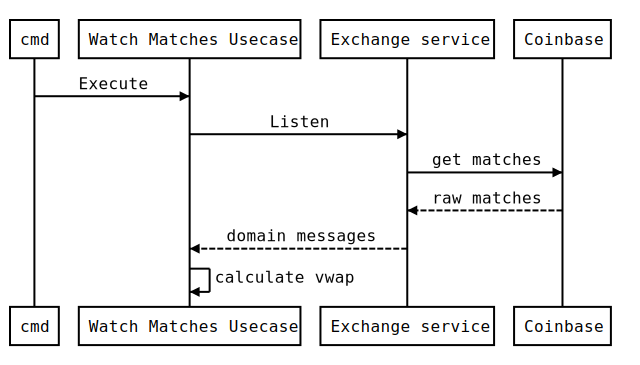

# Crypto Watcher

Find vwap given subscriptions

[](https://circleci.com/gh/RafaDias/vwap-matches-watcher/tree/main)

## How to config?
1. Clone the repository
2. Copy the .env.example in root directory with name .env

```console
git clone https://github.com/RafaDias/vwap-matches-watcher.git crypto-watcher
cd crypto-watcher
cp configs/.env.example .env
```

## How to run?

### locally:
```console
make run
```

### Using Docker:
```console
make build
docker run crypto-watcher:1.0.0
```

### Using KIND:

```console
make build      # creates a docker image for crypto-watcher 
make kind-up    # creates a cluster to simulate k8s
make kind-load  # load the crypto-watcher in envinroment
make kind-apply # Create a deployment with that image
make kind-logs  # Get logs from pods
```

## How It Works
TBD.

## The Architecture
### Overview



## Demo
  TBD.


## Author
- [Rafael Dias](https://www.linkedin.com/in/rafaeldiasmello/)