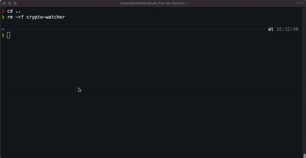
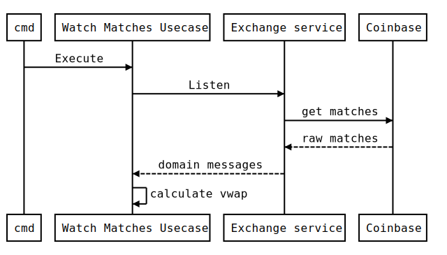

# Crypto Watcher

Find vwap given subscriptions

[](https://circleci.com/gh/RafaDias/vwap-matches-watcher/tree/main)

## How It Works



## How to config?
1. Clone the repository
2. Copy the .env.example in root directory with name .env

```console
git clone https://github.com/RafaDias/vwap-matches-watcher.git crypto-watcher
cd crypto-watcher
cp configs/.env.example .env
```

## How to run?

In the root directory, choose one of the environments below and run the commands:

<details>
<summary>Locally</summary>

```sh
make run
```
</details>

<details>
<summary>Docker</summary>

```sh
make build
docker run crypto-watcher:1.0.0
```
</details>

<details>
<summary>KIND (Kubernetes in docker)</summary>

```sh
make build      # creates a docker image for crypto-watcher 
make kind-up    # creates a cluster to simulate k8s
make kind-load  # load the crypto-watcher in envinroment
make kind-apply # Create a deployment with that image
make kind-logs  # Get logs from pods
```
</details>

## The Architecture
### Overview



This project was developed following the principles of `clean architecture` and golang standard layout:
- [cmd/crypto-watcher](cmd/crypto-watcher) - It is the folder responsible for storing the main file and therefore the build itself;
- [configs](configs) - Just a folder for configurations, link environment variables;
- [deployments](deployments) - Packaging and Continuous Integration;
- [build](build) - Packaging (Docker);
- [internal](internal) - Project source files;
- [static](.images) - Static files, like images.

The source code is organized as follows:
- [application/usecase](internal/application/usecase) - Use cases orchestrate the flow of data to and from the entities, and direct those entities to use their Critical Business Rules to achieve the goals of the use case.
- [application/providers](internal/application/providers) - Integration with a support service.
- [domain](internal/domain) - The heart of the application. Contains the business rules.
- [infra](internal/infra) - It is the "dirtiest" layer of the project. Contains implementations of domain layer abstractions

## Demo
  TBD.


## Author
- [Rafael Dias](https://www.linkedin.com/in/rafaeldiasmello/)